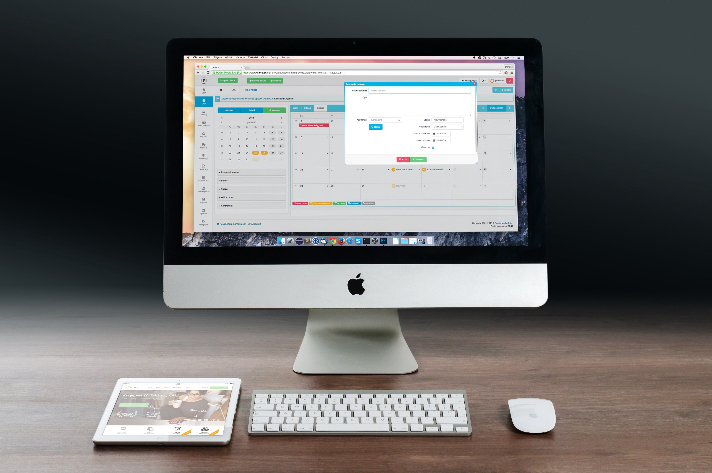

_Originally written for [FreeCodeCamp](https://www.freecodecamp.org/news/tools-i-wish-i-had-known-about-when-i-started-coding-revisited-ffb715ffd23f/)_

A few days ago, I wrote [this article for freeCodeCamp](https://www.freecodecamp.org/news/tools-i-wish-i-had-known-about-when-i-started-coding-57849efd9248/) which has since gone on to be read more times than I could have ever imagined. The response from the community has been overwhelming, humbling, and inspiring.

With the intent of spreading that article as far and wide as I could, I posted it to [r/learnprogramming](https://www.reddit.com/r/learnprogramming/) thinking that some of the aspiring programmers there might find it helpful. [The post can be found here.](https://www.reddit.com/r/learnprogramming/comments/7y08m9/tools_i_wish_i_had_known_about_when_i_started/)

I thought that post might get banned for self-promotion, but what followed instead was a flood of tool recommendations. Since the last article proved useful to at least a few of you, I went ahead and organized the suggestions from that thread for those that are operating-system agnostic, Mac specific, and Windows specific. Now, before the Linux folks get all up in arms, there are versions of most of these available for you, too. We can all win.

I considered including the usernames of the Redditors that made the recommendations, but since I am not sure if they appreciate being called out, I will assume all responsibility for any tool you find sub-par.

Feel free to jump around.

## Operating System Agnostic

  

- [Postman](https://www.getpostman.com/) — At its most basic, this is an application that allows you to test the different endpoints of an API. You know, that good CRUD stuff. Once you dive deeper into it, you will find it is also incredibly useful for writing up test suites and much more.

- [Insomnia](https://insomnia.rest/) — This is an open-source alternative to Postman. It appears to have a lot of the same functionality with a slightly lower price tag for their premium packages. Between this and Postman, the choice seems to mostly be personal preference for the UX. Don’t stay up all night making a decision between the two (I had to, forgive me).

- [Restlet](https://chrome.google.com/webstore/detail/talend-api-tester-free-ed/aejoelaoggembcahagimdiliamlcdmfm?hl=en) — If you don’t want to download either of the above, this is an API testing client that is available as a Chrome extension. It even allows the importing of Postman tests and several other formats.

- [Charles](https://www.charlesproxy.com/) — This is a sweet web debugging proxy that allows you to view all of the information you could possibly want to see about the requests being made between your machine and the internet. It basically turns you into a hacker, allowing you to check your website for security vulnerabilities and such.

- [Fiddler](https://www.telerik.com/fiddler) — Basically the same tool as Charles. Personal preference seems to be the main deciding factor between the two, though both can greatly increase your debugging/troubleshooting capabilities.

- [Flux](https://justgetflux.com/) — If you’re reading this, chances are you probably spend a ton of time on your computer. Flux is a program that turns the blue light down on your screen as the sun sets, with the hopes of mimicking the day/night cycle and helping you sleep better. Not as good as getting time away from the screen, certainly, but it’s better than nothing!

## Mac Specific

  

- [Paw](https://paw.cloud/) — A competitor to both Postman and Insomnia above, Paw is a similar piece of software that feels more like a native Mac application than the others. If you love that Mac feel, this might be the API tool for you.

- [Dash](https://kapeli.com/dash) — With over 200 documentation sets to search through, Dash is an offline goldmine of documentation for the developer who loves to read documentation so much that they do it even when the internet is out.

- [Bear](https://bear.app/) — Not directly coding related, but a neat piece of software for taking notes if that is something you do in your day-to-day. I can’t help but wish that this would be integrated with Paw somehow, for pun-related purposes.

- [Magnet](https://apps.apple.com/us/app/magnet/id441258766?mt=12) — Okay. Fair warning: This one costs money. If you can afford to dish up the 99 cents, however, I think it is worth it for those tough times when you don’t have access to a second monitor. This tool allows you to easily snap different windows to separate areas of your screen so you can run multiple terminals at once and tell your mom you are a hacker. (They are not paying me for this recommendation, sadly. However, if you are the creator of Magnet and you wish to pay me, please get in touch).

## Windows Specific

  

- [ConEmu](https://conemu.github.io/) — If you are on Windows and you would like to have multiple terminal tabs, this is an easy, free solution to your tab-related woes. Never again will you have to flip back and forth through entire windows just to look at your different error messages.

- [Ditto](https://ditto-cp.sourceforge.io/) — You know when you’re trying to copy four separate answers from Stack Overflow and you have to keep switching back and forth from your browser to your IDE? Worry no more. With the Ditto clipboard manager, you can copy-paste your way to victory.

- [TouchCursor](http://martin-stone.github.io/touchcursor/) — Programmers of all sorts are notorious for wanting to use the mouse as little as possible. If you find yourself in that camp, then this will be right up your alley.

- [Cmder](https://cmder.net/) — I am going to forego my description of this product, as I feel the description on their website is much better — “Cmder is a software package created out of pure frustration over the absence of nice console emulators on Windows. It is based on amazing software, and spiced up with the Monokai color scheme and a custom prompt layout, looking sexy from the start.” I don’t know about you, but I am a fan of any software that describes itself as “sexy”.

- [Directory Opus](https://www.gpsoft.com.au/) — This is basically what Windows Explorer should have been from the start. Opus allows you to dig through your poorly-organized documents almost as if they were well-organized.

- [Zeal](https://zealdocs.org/) — With over 200 documentation sets to search through, Zeal is an offline goldmine of documentation for the developer who loves to read documentation so much that they do it even when the internet is out. (Copy-pasted from Dash in the Mac section).

## Honorable Mention

If you are feeling particularly sadistic, throw out your current IDE and learn to use [Vim](https://www.vim.org/), [Grep](https://www.gnu.org/software/grep/manual/grep.html), [Zsh](http://zsh.sourceforge.net/), and/or [ack](https://beyondgrep.com/). From what I hear, these can super-charge your productivity once you get over the formidable learning curve. However, I don’t hate myself enough to find out.

## In Conclusion

As I’ve mentioned before, there is almost always more than one way to do any given thing. And it is more important to learn to use the tools you already have, rather than to go installing things willy-nilly with the hopes that it will somehow make you a Leet coder.

For example, if you go to the [post I made it on Reddit](https://www.reddit.com/r/learnprogramming/comments/7y08m9/tools_i_wish_i_had_known_about_when_i_started/) you’ll see there are 26 comments about tools to pick colors alone. I almost included them here but having a whole subsection for color-pickers seemed excessive.

### If you have any questions or want to chat [hit me up on Twitter](https://twitter.com/marioahoyos) - I'm an open book.
