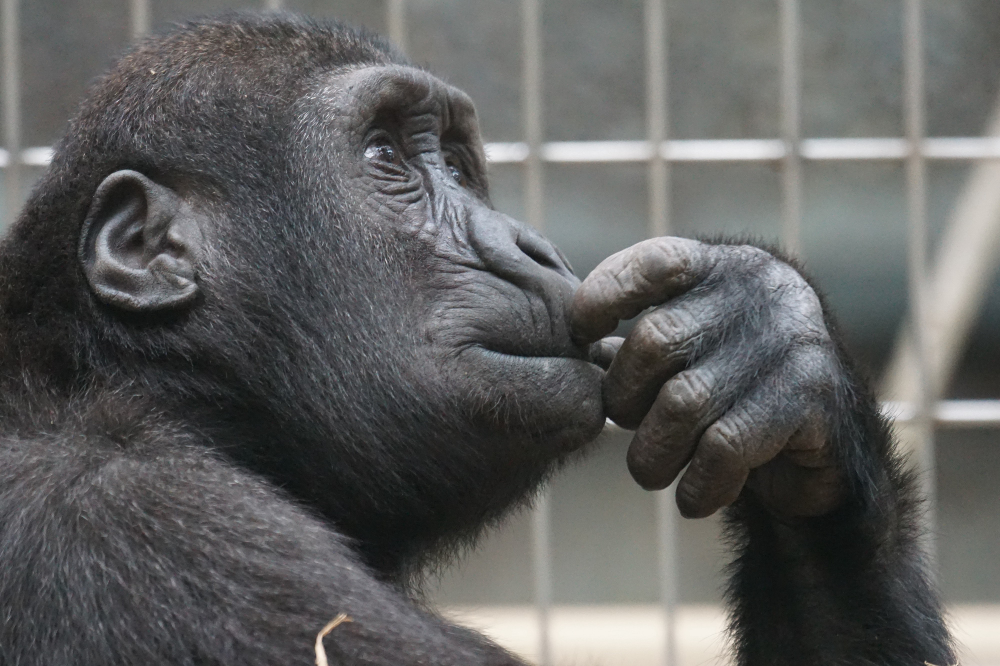

I’m probably going to regret this.

In my senior year of high school, I had a British Literature class with a teacher who was either loved or hated by her students, not too many were in the middle. I started off towards the hate side, but I grew to love her as a teacher as the class progressed.

Her class culminated in one final project where each student had to write 100 statements about their beliefs.

**This might be the most important assignment I completed in all of high school.**

It is not very often that any of us sit down to think about our beliefs. Forcing high school seniors to do just that is teaching-genius. We all even had to feel strongly enough about our beliefs that we would be willing to read them out loud in front of our peers.

I was digging around in my Google Docs the other day and came across this very project. It was dated February 11, 2011, almost exactly seven years from the day that I’m writing this.

As I read through the statements I realized how much has changed since then, but I was also surprised to see that many of my beliefs stayed the same.

As a challenge to myself, I decided to go through all of my old beliefs and examine why I may have written them at the time, and how I feel about them today.

This article was definitely written more for myself than for anybody else. I do think, however, that there may be something to learn at my expense if you find yourself struck with curiosity.
If nothing else, I promise you will at least get an opportunity to chuckle at how naive I was (and probably still am).

Here goes nothing.

1.  I believe in myself. — Thankfully, this one still rings true today. With some exceptions here and there, I generally do not suffer from a lack of confidence. When I set my mind on something I can become 100% convinced that I will achieve it, even though I have proven myself wrong countless times.
1.  I believe that everyone is entitled to their opinion. — Hey I’m two-for-two! I still believe this one as well. Obviously I disagree with different people on many points, but I do believe everyone should be able to think what they want.
1.  I believe some people’s opinions are wrong and some are stupid. — Damn. Just when it seemed like I was going to come out of this looking like an open-minded individual. In all seriousness, though, it is impossible to have strong opinions about anything without also believing that some other people’s opinions are wrong and/or stupid. You’ll surely feel that way about mine as you read through these!
1.  I believe in some conspiracy theories. — Oh boy. I’m pretty sure I wrote these right after watching Zeitgeist. I went through a brief period where I was really into books and documentaries about this kind of thing. Surely we don’t always get the full story but I definitely think most conspiracies don’t hold water (looking at you flat-earthers)!
1.  I believe soccer is the greatest sport on the planet. — There’s no room for argument on this one.
1.  I believe that the rest of the world, with the United States as the exception, agrees with me. — Reference the answer to number 5 above.
1.  I believe in the metric system. — YES! Consistent prefixes and suffixes, multiples of ten, a temperature system with easy-to-remember freezing and boiling points, there’s nothing not to love. Whoever decided measuring things in feet and inches was a good idea just might be my least favorite person in all of history.
1.  I believe one dollar McDoubles are too good of a deal to pass up. — This would still be SO true if they were actually a dollar these days. Who has \$1.29 just laying around?
1.  I believe that people need to relax. — Clearly I was much more emotionally mature than the rest of my high school peers (please). Though I do believe we all sweat the little things more than we probably should, I’m just as guilty.
1.  I believe in a parallel universe made up of antimatter. — I clearly thought I was very smart. I wish I could explain to you all how this antimatter stuff works, except I don’t understand it now and I definitely didn’t understand it then. Not to say it can’t be true, just saying I haven’t the slightest clue.
1.  I believe that people need to learn to control their emotions and learn when and how to express them. — As mentioned earlier, I must have thought I had a better handle on my emotions than those around me. This was written by the guy who cried after several high school soccer losses. I like to think I’m a little more self-aware these days, but now I err on the side of caution and am more likely to admit that I don’t know a damn thing about emotions and how any one person should handle theirs.
1.  I believe that every day is the first one of the rest of your life. — I guess this is technically true but that doesn’t change the fact I hate myself a little bit for writing this. I don’t even think Pinterest was a thing yet. Was I just going around reading Hallmark cards?
1.  I believe people need to cross the street more intelligently. — Ahhhhh. My superior intellect shines through once again. It’s funny how about a year after writing this I almost got smoked by a huge bus at my university because I was so distracted trying to prank-call a friend of mine. Do as I say not as I do, or whatever.
1.  I believe that too many mainstream rappers take away from the art of true hip hop. — Obviously, I was a connoisseur of the fine art of TRUE hip-hop. While I agree there is something impressive about a display of lyrical complexity, I am not above head-bobbing to the likes of Lil Pump, Ugly God, and such. I took myself too seriously back then.
1.  I believe in not smoking anything. — As a licensed pharmacist, I must say that if you smoke cigarettes, you should at least consider quitting. As far as smoking other things, like pot, I don’t think there is any harm whatsoever so long as it doesn’t become the sole focus of your existence. I think we can all also agree that smoking crack is probably not good.
1.  I believe in not drinking alcohol, but I do not judge those who do. — Well. College me really screwed the pooch on this one.
1.  I believe my father’s jail time is my motivation to succeed in life. — This one is a little more difficult to pick apart. I do want to note that my father and I are on good terms these days. Growing up I think I was always angry with him for not being around, but now that I’ve grown up (relatively), I can see the bigger picture a little better. He was a victim, to some degree, of circumstance and he has learned from his mistakes and moved on. Though I harnessed some of that anger and used it as motivation to try and get ahead, I’m sure there’s other ways I could have channeled that energy. Before it starts sounding like I was somehow deprived growing up, I want to clarify that my mom did an AMAZING job of being both of my parents for a while. Not only that, but after some time of it being just me and my mom, she scooped up an extremely supportive husband who served as a solid father-figure in my life for the years to come. If you are reading this and have been made to feel bad because your parents weren’t married (I was a surprise) or because they separated later on, know that you are not alone. There’s a ton of us and I think for the most part, we likely turned out alright.
1.  I believe that life does go on. — Though cheesy, this still rings true to me. In my short lifetime I have found time and time again that bad stuff happens and then the world keeps right on spinning. I remember when my middle-school girlfriend, Giuliana, and I broke up I thought the world was coming to an end. In my most melo-dramatic moment ever, I cried in a CLOSET! Turns out everything is fine and the rapture never came. Who would have thought?
1.  I believe time heals most wounds, and can camouflage some temporarily. — Basically the same sentiment as number 18.
1.  I believe the angriest people lack the ability to laugh at themselves. — I may not have known much back then but I hit this one on the head. If I didn’t laugh at all the dumb shit I do, I would be downright miserable. If you are downright miserable, consider laughing at yourself sometimes. If you are looking for a good reason to laugh at yourself, write down a bunch of 1. things you believe right now and then read it in seven years — Works like a charm.
1.  I believe in a god of sorts, but not the Christian one. — I don’t even know that I would say I even believe in a god of sorts at this point. I consider myself to be spiritual but in the foo-foo “we are all one with the universe” way. I definitely don’t subscribe to a particular dogma, but I don’t have a problem with people practicing whatever religion they prefer so long as they aren’t infringing on others by doing so.
1.  I believe in respecting people who believe in their religions. — It’s sad that this still isn’t common enough.
1.  I believe the Xbox 360 if better than the PS3. — This was probably due to the fact I had a 360 and didn’t want to be on the losing team. I have no opinion with regards to this anymore.
1.  I believe Goldeneye is the best first person shooter ever. — This is nostalgia speaking.
1.  I believe Zelda: Ocarina of Time is the greatest role playing game ever. — This is nostalgia speaking.
1.  I believe folky Country music is a horrid creation. — I would change this to say that country music is terrible, but would be cautious about using the word “folky”. I enjoy some “folky” music such as The Lumineers, Neutral Milk Hotel, etcetera.
1.  I believe screamo heavy metal music is second to folky country. — I definitely thought I was too cool to listen to the stuff the “emo” kids were listening to back then. This belief would come back to bite me halfway through college when I suddenly got super into the bands I used to make fun of, but by now everyone else had outgrown them. What goes around comes around, I guess.
1.  I believe black people have more soul and are better singers than white people. — I still can’t help but feel like it’s probably true. I mean, are you going to tell me Boys II Men and The Backstreet Boys are on the same level? Brian McKnight or Clay Aiken? Allen Stone makes a strong case for a tie, however.
1.  I believe in dance. — Though I would probably phrase it to sound less like the subtitle of Step Up 5, I definitely believe that dancing is a great outlet. Many of my fondest memories involve dancing my ass off at a popular bar at Purdue called The Neon Cactus.
1.  I believe in working for a living. — What a square. These days I’m trying to figure out a way to work because I want to, not because I have to.
1.  I believe in not knocking something until you try it. — Still true (mostly).
1.  I believe that women only mature faster than men physically. — Oh boy. In high school, I really enjoyed saying things that would get people riled up. In this case, it would seem I was far ahead of my time. Past-me would be super content knowing that I have to talk about this in the current climate. Thankfully, I can honestly take the easy way out and say that I disagree. Not that I think that women also mature faster than men mentally, I just think you can’t make a blanket statement for either gender as a whole.
1.  I believe being a male is easier than being a female. — Back in good graces, I hope! This one is undoubtedly true today. Let’s just think about it biologically, without getting into the societal implications. Women carry children around for NINE MONTHS. Nine. If we, as men, simply show up to the monthly appointments, we are heralded as exceptionally-supportive fathers. It’s pretty wild. Women also have things like menstrual cycles and menopause to deal with, where as a man you basically just have to not die. It’s not even close.
1.  I believe in traveling the world. — This is even more true to me today than it was back then. I wouldn’t be the person I am, for better or for worse, without having traveled to other parts of the world and I think it might just be the most valuable way to spend disposable income.
1.  I believe in reading quotes from philosophers. — I wish I was still this deep. These days I mostly read quotes from Shea Serrano on Twitter, which one could argue is just as enriching.
1.  I believe in self competition. — I’ve always competed fervently against myself. It’s my gift and my curse. This quality has allowed me to achieve whatever success I’ve had but is also what has caused me to rip myself to shreds when I fail. I’m trying to get better at keeping perspective every day.
1.  I believe Dragonball Z is the best cartoon ever made. — A whole generation of now-grown-ups agrees with me here.
1.  I believe the cartoons kids watch these days are garbage compared to what I had. — This is a bias as old as time. Speaking objectively, however, Goku would definitely suplex Peppa Pig.
1.  I believe the Looney Tunes creators are geniuses. —Meh.
1.  I believe in tattoos as a form of expression. — Still do! I have five of my own so far.
1.  I believe Jade Garden serves the best Chinese food in Elkhart. — I don’t even live in Elkhart anymore and can still say, beyond a shadow of a doubt, this is true.
1.  I believe in humans with supernatural abilities. — This depends how you define supernatural I guess, but my mom raised me and my two crazy-ass brothers largely by herself, so yeah.
1.  I believe that European mythology is far more interesting than most other religions. — This is definitely still true. European mythology is so cool there’s blockbuster superhero movies about Thor, a Nordic god. My name, Mario, stems from Mars, the Roman god of war, which is probably the most hardcore thing I have to offer.
1.  I believe a samurai would defeat a Spartan warrior, but both would lose to a ninja. — Isn’t there a tv show about this now? There’s an entire website dedicated to it.
1.  I believe Will Smith’s family is perfect. —Though I was a huge Will Smith fan at the time I wrote this, I still believe it to be true. What a beautiful bunch of talented people they are! 1. I’ll even stick my neck out there and say that I enjoyed Jaden Smith’s latest album — Go ahead and judge me.
1.  I believe in original movies over their re-makes. — I feel like I just held this opinion because it sounds smart. I can’t even think of a movie off the top of my head right now where I’ve seen the original and the remake, much less which one I preferred.
1.  I believe in the “Eff it” philosophy. — I still think that sometimes the best thing you can do is say “Eff it” (or “fuck it”, if my censored-for-school version doesn’t make sense to you). This does not work in all situations, however, such as deciding if you want to adopt an animal or other similarly important decisions.
1.  I believe fist fights accomplish nothing. — Fist fights are cool in Dragonball Z, but I can’t really imagine another scenario where the fate of the world is going to be determined via fisticuffs.
1.  I believe that money is the root of all evil. — I definitely plagiarized this from somewhere. Though it’s certainly nice to have a comfortable amount of money, I learned the hard way that money alone isn’t all it’s cracked up to be and you can read about it here.
1.  I believe that Alaska would be a horrible place to live. — Wow, we made it halfway through! I think Alaska could be neat, for a little while.
1.  I believe Colombian people are much friendlier than Americans. — Disclaimer: I am half-Colombian and am probably biased as such. I do not think that this statement is really accurate though. It all goes back to not being able to make blanket statements about people.
1.  I believe that Colombian food is much better than American food. — I do still believe this one! There is no food that tops a Colombian empanada. I’m damn near religious about empanadas. Empanadas could solve all of the world’s problems.
1.  I believe that Colombian women are more gorgeous than American women. — As it turns out, I am attracted to women from all over the world. I’m pretty sure I was just trying to ruffle some feathers.
1.  I do not believe in senseless patriotism. — True. In my humble opinion, patriotism in and of itself is not a virtue.
1.  I believe cusswords can be used to effectively add emphasis and humor to statements. — Fuck yeah!
1.  I believe it does not matter if you have sex before marriage, after, or never. — I’m guessing I was trying to say that people shouldn’t be judged for their sexual choices. At least I hope that’s what I was getting at. That being said, I wouldn’t wish a sexless existence on my worst enemy.
1.  I believe people use alcohol as an excuse to act like the obnoxious, promiscuous individuals that they really are. — Suffice it to say, high-school me would have been deeply disappointed in college-me.
1.  I believe that balling is a habit. — This is the kind of belief you write when you listen to a lot of rap music.
1.  I believe that music controls the human emotions. —Personally, music still has this effect. It’s not only good for listening but creating it is equally (if not more) therapeutic.
1.  I believe that if everyone was happy with whom they are, the world would be a better place. — Though this is likely true, it’s certainly some wishful thinking. Somedays I’m not even happy with myself.
1.  I believe there are too many hypocrites in high school. — I could update this to say that there are too many hypocrites everywhere, myself included.
1.  I believe any man who lets a woman ruin a friendship is a fool. — Life is never this simple. I don’t know why I felt the need to specify which sex is ruining which friendship. Romantic relationships and friendships are both precious things and should be treated as such.
1.  I believe any woman who ruins a man’s friendship is a female dog. — I’m going to take a stab in the dark here and say that I was personally affected by a situation like this at the time. That, or I was trying to ruffle feathers. Either way, I disagree here.
1.  I believe in forgetting about the past and moving on. — Forgetting the past and learning from it are two very different things. I lean more strongly towards learning from it today.
1.  I believe that social studies classes are a gigantic waste of time. — I often wish I had paid more attention in social studies. History repeats itself and being knowledgeable about it can be very useful.
1.  I believe the human mind is not understandable and psychiatrists are just well-paid pretenders. — I guess I thought I knew more about the mind than I did. Though I certainly don’t believe we have a full grasp on how the mind works, I definitely don’t believe that psychiatrists are “well-paid pretenders.” I’ve reaped the benefits of therapy myself, and would encourage anybody on the fence about getting help to try it out.
1.  I believe cities are huge monuments to the greatness mankind is capable of. — This is still true. Logistically, cities are about as complex as it gets. Think about how many people have to 1. work in unison in order to build a city and make it prosper— Amazing.
1.  I believe AIDS was created by the government in order to reap Africa’s natural resources. — Refer back to number 4. I doubt this is true.

1.  I believe racist jokes are the funniest of jokes and laughing at them does not speak about your beliefs. — Hmmmmmmm. This is a dangerous one. I still think it’s true. I love watching a standup performance where the comedian picks apart the absurdities of racism. Dave Chapelle is my favorite, if you are looking for examples. I am not a racist. If we ruin the opportunity for comics to make fun of any and all things, and lose the ability to laugh at ourselves, then we are in big trouble.
1.  I believe that too many teenagers are insecure about their beliefs and it brings drama upon them. — Hahahaha. Yes, I was definitely way more in touch with my beliefs and much less drama-prone than my peers. This is cringe-inducing.
1.  I believe in improving myself in any way I can. — Still true. I am sometimes obsessed with self-improvement to a fault. Reference number 36.
1.  I believe in accepting those flaws and things which I cannot change. — Cliche, but true. If you think you have a problem and you can do something about it, there’s no problem. If you think you have a problem and you can’t do anything about it, there’s no problem.
1.  I believe being a human can be a curse. — The teenage angst is super apparent here. There’s ups and downs to being a human, but when it’s all said and done, I’m happy to exist.
1.  I believe we as humans can learn a lot from animals. — True. Nature as a whole has a lot to teach us. Many of our most useful drugs were inspired by nature. Many of our behaviors can be explained by evolution. I recently watched Planet Earth and if you can watch that without being in awe then I don’t even know what’s wrong with you.
1.  I believe in extraterrestrial life. — Given the immensity of the universe, I think it’s conceited to believe that we are the only life out there.
1.  I believe that Jesus was a black man. — Just due to the geography of the Bible, it’s probably more likely that he looked like a middle-eastern man. I can’t imagine he was white.
1.  I believe religion is what people use to explain that which science cannot as of now. — Judgmental tone aside, I do think this is true to some degree. We consider mythology to be obviously fictional now, but at the time those stories served to explain the natural phenomena that people could not understand. I am not saying that this is the only function that religion serves, but it’s hard to argue that historically this isn’t one of them.
1.  I believe all governments are corrupt. — Sure. In varying degrees of course, but any centralization of power is going to lead to some amount of corruption. Governments are run by flawed human beings like the rest of us, after all.
1.  I believe that legalizing marijuana would solve a lot of problems and stimulate the economy. — Definitely still on board with this one. A quick glimpse at the amount of money generated in Colorado speaks volumes for the economic benefits. Taking away the power from blood-thirsty cartels would also likely be a nice side-effect of nation-wide legalization. If we remove the stigma and view marijuana objectively, it is AT LEAST as safe as alcohol and we as a society have decided that alcohol is okay to sell. A drug is a drug is a drug. Drink coffee? You’re a drug abuser. Drink alcohol? Drug abuser. I am not advocating going out and doing drugs, I just want to highlight the weird bias we carry that some drugs are inherently better than others. If you eat or drink enough of anything, it’ll kill you. It is my hope that we as a society will view drugs more objectively in the future. I could go on, but I won’t.
1.  I believe if you are not in Taylorgang you die. — Not even worth writing about.
1.  I believe without illegal immigrants the United States would collapse. — Oh, man. Things got political all of a sudden. I still believe this without a shadow of a doubt. It’s easy to point to outsiders as the cause for our problems, whether it’s true or not (it’s not). Let us not forget that the United States was founded by a bunch of Puritan refugees, who stole the land from the Native Americans.
1.  I believe Americans are bigots. — This is just stupid. Slapping a label like this on all Americans is seriously immature. I think I was probably just trying to stir the pot, which is also seriously immature. Bigots exist all over the world, not just here.
1.  I believe jewelry is foolish and overrated. — This is mostly true. I want to note that this is just a matter of personal opinion, though. I don’t care if you like jewelry and use it to express yourself, you just won’t catch me spending thousands of dollars on a shiny piece of metal.
1.  I believe that in the big scheme of things, nothing matters that much. — There is so much to unpack here. This is one of the beliefs that I was surprised to see I held back in high school. At first glance, it sounds depressing right? To think about you and everyone you care about not mattering is sad right? I don’t think so. I think it is liberating. There’s 7 billion people on the planet today. When you get upset about your flat tire, there are maybe a couple people besides yourself who give a damn. The world just keeps spinning. When you have a bad day at work, those close to you will be willing to hear you complain about it, but the rest of the universe could not possibly care less. That’s obviously an oversimplification of the point I’m trying to make. The point I really want to drive home is that what is affecting you negatively today probably isn’t that big of a deal, in all reality. We like to feel special, sure, and I would encourage you to surround yourself with people who will lift you up and support you; that’s the fun part about being a human. I’m not saying that nothing should matter to you, either. My mom matters to me more than any other person in the world, and surely I matter to her too, but if we both died today, how would the stars be affected? They wouldn’t. The day I realized that I am not “special”, I freed myself from any expectations that the world may have set for me. What I end up doing with my life will ultimately only matter to myself, and maybe a few others for a while, but when I die there will be no real consequence. The absurd insignificance of my life is what allows me to enjoy it as much as I do. I am annoyingly optimistic about everything, I will admit it. To people that hold a more pessimistic view, I am a giant pain in the ass. Because of that, people are often shocked to find that I don’t believe in an afterlife. This is another belief that people usually think is depressing, in one way or another. “Well, if there’s no afterlife, then what’s the point of anything?” How I see it, if all I have is this one life to live, I damn well better take full advantage of every minute. The odds of me existing as I am are so infinitesimally small that to not treasure what limited time I have here would be blasphemy. I don’t try to be a good person because I think it’s going to get me something in the future (not consciously anyway), and I don’t like to base my actions on how an after-life I can’t be sure exists will be affected. Instead, I try to be a decent person because being an asshole is no fun (I know, because I’ve been a terrible person in one way or another many times in my life and have always felt bad about it). Life is way too short to be miserable, in my humble opinion, and since nobody but you probably actually gives a fuck what you do with your life, do what you want and try to be happy.
1.  I believe babies should have a say about their circumcision. — Funny story. Growing up, I did not even know that circumcision was a thing since I am very un-circumcised. When I first found out about it, I thought it was a barbaric practice. I remember asking some of my friends about it and I slowly pieced together that I was the odd one out. I have seen the medical and cultural arguments for circumcision and I do not know how to feel about it. It’s kind of weird that parents decide to remove a natural structure from their children, but I can also see how this might not be so weird when viewing it as the medically-sound thing to do. I’m not really sure where I stand on this whole thing, honestly, I think that high school me probably just got a kick out of making everyone in the room think about penises.
1.  I believe gay marriage should be legal everywhere. — This one is so obviously true that I won’t even waste keystrokes defending it.
1.  I believe language as a written art form cannot be taught as an English class. — Crazy how I wouldn’t be writing this today if it wasn’t for English class. I don’t claim to be a great writer by any means, but I would undoubtedly be worse if I hadn’t been taught some basic concepts in school. I also always enjoyed the vocabulary portion of class, as learning new ways to say the same thing was interesting to me. Ubiquitous. That’s a word that I learned back then and I use ubiquitously today.
1.  I believe it is funny to make fun of rich people. — This is clearly written by somebody who was salty about not being rich.
1.  I believe making fun of rich people makes you look jealous and stupid. — At least number 88 was written by somebody who could see that they were being stupid and jealous.
1.  I believe policemen are power-hungry. — Another false blanket statement. There is room for improvement in our law enforcement, to be sure, but I would never go so far as to say that all policemen are bad or power-hungry individuals.
1.  I believe the writers of South Park are geniuses. — I don’t even think I’ve watched South Park in years but as far as satires of our society, I still think it’s a tough show to top. It’s been around for 20 years for a reason.
1.  I believe too many people are scared to speak their mind. — This is super funny coming from a person who does not like confrontation. I think this is one of those cases of somebody trying to cover up their weaknesses. At least now I’ve acknowledged this about myself and try to lean into it a little more, for example, by spilling my brain out onto this article.
1.  I believe people who believe masturbation is gross are immature. — So…sure. This is true. Why high-school-me thought it was a good idea to essentially advertise my bedroom habits to my classmates I have no idea (sorry, Mom, if you’re reading this).
1.  I believe Ne-Yo is a musical mastermind. — Definitely an overstatement. I did thoroughly enjoy his music at the time, and still do on occasion, but he’s no Mozart or anything.
1.  I believe genius and insane go hand-in-hand. — I think to some degree this is still true. I can’t decide whether it’s really that insane to break societal norms in order to provide something new and useful to humanity. History is littered with people who were considered crazy during their time but provided valuable contributions to society as a whole. Not all geniuses are crazy, and not all crazy people are geniuses. I’m not even sure I could come up with a good definition of what it means to be “insane” anyway.
1.  I believe girls with classy tattoos, such as Christina Perri, are sexy. — In case you didn’t know, I am the utmost authority as to what classifies a tattoo as classy (heavy, heavy sarcasm). I think what really happened here is that I found Christina Perri sexy at the time, and extrapolated from there that her tattoos are classy. I honestly couldn’t tell you what tattoos she has. I have no right to determine what makes a “classy” tattoo.
1.  I believe if I was a girl I would be a hoe. — I basically read this as “I am a horny teenage boy and somehow feel that if I was a girl it would be easier for me to get laid.” I’m pretty sure I phrased it this way to get people riled up, and it was probably really a way of covering up some insecurity. Shame, high-school-me, shame.
1.  I believe guys make better friends than girls. — I have great friends on both ends of the spectrum. I think I was definitely just annoyed about something at the time. It seems to be a general thread throughout this whole ordeal.
1.  I believe writing “I believe” statements about your peers is foolish. — Said Mario, as he wrote “I believe” statements about all of his peers, establishing his superiority over his fellow high-school students.
1.  I believe that concluding papers with a “bang” is overrated. — I thought I was soooooo clever ending my paper this way.

## Closing Thoughts

  

Well. This has been thoroughly embarrassing.

If you’ve learned nothing else at my expense, at least take this as proof that people can change the way they look at the world. I don’t think I would have gotten too far in life if my mind-state hadn’t changed over time. The plasticity of our brain is arguably what most sets us apart from all the other animals in the kingdom.

Take any opportunity you can to hear a viewpoint that contradicts yours. In today’s world, it is far easier to stick yourself in an echo chamber where you only hear opinions that reinforce your current beliefs, whether they are based on truth or not.

I hope high-school me didn’t ruffle your feathers too much and if present-me ruffled your feathers, let’s have a discussion about it. I’m willing to accept that I may be wrong about some things but I may not know it if we don’t talk about it.

In the exercise of writing this article, I have been forced to really think about what I believe. Having to define my views in writing has allowed me to see inconsistencies in my train of thought and course-correct. I would encourage you to do something similar if you have the time (no need to do 100 statements or to publicize them, let me take the public shaming for you).
Writing this has been a lot of fun, in a twisted way. I hope that you have found some value in reading this, as well.

_(Future-Mario, if you are reading this, let me apologize preemptively for whatever shortcomings you’ve identified in reading through my reasoning. Hopefully when you rewrite this, years from now, you won’t be entirely disappointed in how I feel today.)_
