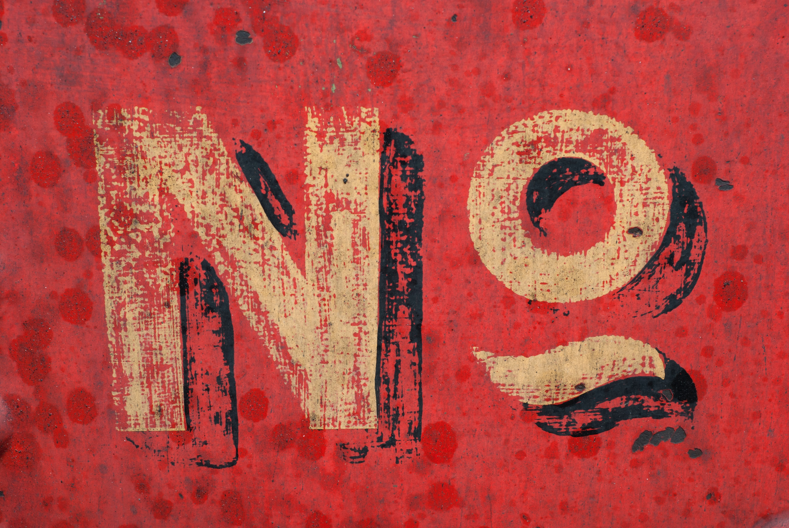

## There are obvious reasons why somebody might want to become a programmer:

- [Software Developer was ranked the #1 job in 2020, based on more than pay alone.](https://money.usnews.com/careers/best-jobs/software-developer)
- There is a high level of autonomy, [which we know helps people find meaning in their work.](https://www.nbcnews.com/better/careers/research-says-secret-being-happy-work-n762926)
- [The hours are generally flexible.](https://www.flexjobs.com/blog/post/top-10-career-fields-for-flexible-jobs-v2/)
- [The potential for remote work is high.](https://remoteok.io/remote-dev-jobs)
- [The future is promising.](https://www.bls.gov/ooh/computer-and-information-technology/software-developers.htm#tab-6)

In addition to the more data-driven points above there are other, less measurable, pieces that I (and others I know) find fulfilling:

- Solving ambiguous problems is infuriating sometimes, but it’s always worth the feeling of self-accomplishment when you figure it out.
- It's usually easy to see the impact your work has on the company’s bottom line. Whether you’re writing code for your freelancing business or cranking out features for BigTechCo, you are building something _tangible_.
- I work with people who are more intelligent than me everyday.
- There is always opportunity for professional growth. Though the career-ladder differs by company, there is always a position to grow into, be it technical or management-oriented.
- Programming is a skill you can use outside of work, if you want. As a silly example, I once wrote a script that emailed me when the apartment I wanted to move into was made available to lease. I am sitting in that apartment now.
- There is never a shortage of new things to learn. Sometimes this can be overwhelming, but I find that it keeps things fresh.

## Downsides to being a programmer

  

Being a programmer isn’t all ping-pong and kombucha like TV would have you believe. As with anything, it's just as important to consider the downsides.

- The sheer amount of different things to learn can be overwhelming. There’s a running joke in the JavaScript community that there’s a new framework to learn everyday. Though an exaggeration, it feels that way sometimes.
- The reality of building complex software is you spend a lot of time reading documentation, searching Google, and generally feeling like you are out of your depth. It can be maddening to spend an entire day trying to fix a bug, only to find out it was due to a missing semi-colon. The same things that make computers magical also makes them difficult to work with.
- Most workplaces aren’t diverse enough. Though many companies are trying to get better (or at least pretend they are), [most programming jobs are still held by straight white white males](https://datausa.io/profile/soc/computer-programmers#demographics).
- [Burnout is not uncommon](https://medium.com/hackernoon/why-theres-so-much-burnout-in-software-and-what-to-do-about-it-4ef0297ca7cc). Particularly in startups, the breakneck pace at which you are expected to work can be exhausting. Clients always change their minds, requirements always shift at the last minute, new bugs abound. Learning to manage this pressure takes time. Burnout sneaks up on the best of us.
- Sitting at a computer all day is not good for [your mental or physical well-being](https://www.mayoclinic.org/healthy-lifestyle/adult-health/expert-answers/sitting/faq-20058005).
- You won’t always be working on exciting features. Often, the project you are working on will get canceled. You’ll feel like you wasted your time. Then, even on exciting projects, you will spend much of your time on mundane tasks like writing documentation. You might go days without writing code.
- The flexibility in your work hours can backfire if you're not careful. You'll find yourself working 12 hour days. Your Slack notifications will be going off deep into the night. When your work is as portable as your laptop, it can be difficult to find a work-life balance.

I'm sure there's plenty downside I’m missing. I have an inherent bias towards the benefits since I love what I do, so please keep that in mind.

## Do I need to **love** programming to be worthy?

  

Gatekeepers be damned! There is nothing wrong with becoming a programmer to make money. There's bills to pay and mouths to feed.

Maybe you just want stable health-insurance. Maybe your dream is to work remotely from all over the world. All of your reasons are equally valid.

Coding does not have to be your undying passion. You don't have to start writing software in kindergarden to be successful. Having an innate interest in writing code makes it easier, sure, but it’s far from necessary.

There's a good chance you're reading this because you aren't passionate about your current job and you still get paid to do it right?

## So now what?

I'll ask again, given the ups and downs:

**"Are you _still_ sure you want to be a programmer?"**

It's OKAY if you don't! There's a million things you can do with your life. Just because this works for some doesn't mean it has to work for you.

If, however, you still want to give it a shot:

> 🎉 **AWESOME!** 🎉

I can say without hesitation that learning to code has been one of the best decisions of my life. I am **SO** excited for you!

Next post we will put your answer to the test and dip our toes in code, are you ready?

### In the meantime, if you have any questions or want to chat [hit me up on Twitter](https://twitter.com/marioahoyos) - I'm an open book.
