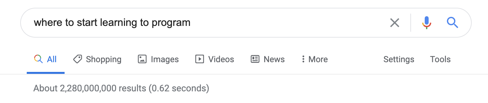
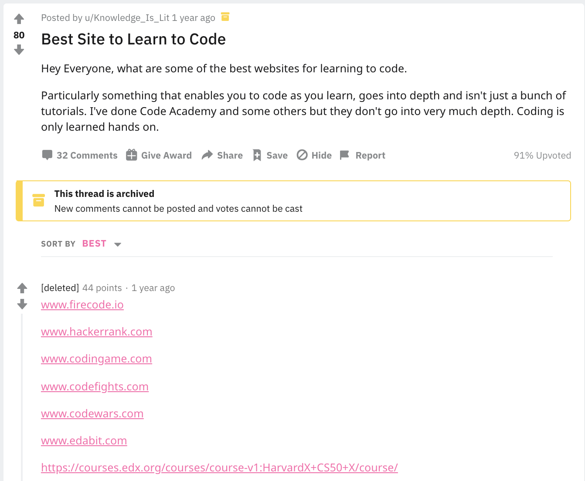

So, you’ve decided either by [reading this](https://mariohoyos.io/So-you-want-to-be-a-programmer-Are-you-sure) or on your own that you want to learn to code. First off, congrats! Programming is a valuable skill and a fun one to learn at that.

The next thing you probably did was google something like “Where to start learning to program?”

  

Only 2.3 _billion_ results! How could you possibly decide?

Ok, so you go to Reddit and look for an answer:

  

Seven different websites in the top answer alone. SEVEN!

All of them having information that is similar enough to seem interchangeable, but also different enough that you feel like you’ll miss out on something important by picking the wrong one.

As you keep digging, you begin to realize that there’s not only an endless amount of resources to learn from, but that [there’s more programming languages than you could ever hope to wrap your head around](https://en.wikipedia.org/wiki/List_of_programming_languages).

Allow me to take some of the pressure off.

At the end of the day, all programming languages rely on the same basic concepts. Computers only understand ones and zeroes, and because of that, all programming languages are constrained in similar ways and thus end up with similar designs.

Another common way to attempt to narrow down what language/resource to begin with is to figure out what you want to build first, and pick the best language for the job. For example, if you want to do video game development, you might want to learn C++, if you are doing machine-learning maybe Python is the right choice.

Again, this quickly gets overwhelming. What if you don't know what you want to build yet? When there's conflicting opinions on which language is the best for a given project, how do I, a beginner, make a good decision?

The absolute worst thing you can do is get stuck in _tutorial purgatory_. 😱

## Tutorial Purgatory

  

Have you found yourself bouncing between different languages, learning resources, and tutorials hoping that you’ll magically come out of the other end able to build useful software? Then you've experience tutorial purgatory.

We all get stuck here when we are starting out because it's comfortable. It feels good to follow along with a video tutorial, writing exactly what you're told to write, and then seeing your code run. Because it feels good, we get _addicted_ to it. We learn how to write a function in three languages, a for-loop in five others, and a switch-case statement in two more.

It feels like you’re making progress and you don’t struggle much because the solution is always right in front of you.

Now, I’m not knocking the thrill of seeing your code run. Ultimately, you’re working to learn something new, something difficult, and you _SHOULD_ celebrate your successes.

This gets dangerous, however, when we stay in this comfort zone and don’t keep building on top of the concepts we learn. Have you noticed that you’ve done hours of tutorials and still don’t know how to begin building that website you’ve been thinking of building? This is what we want to avoid.

I'll make it easy for you for you:

**Start with JavaScript.**

## Why JavaScript?

  

JavaScript powers the internet, and the internet is not going anywhere.

Knowing JavaScript, you can build websites ([both frontend and backend](https://careerkarma.com/blog/javascript-front-end-or-back-end/#:~:text=JavaScript%20is%20used%20in%20both,both%20front%20end%20and%20backend.)), [phone apps](https://reactnative.dev/), [desktop apps](https://www.electronjs.org/), [video games](https://phaser.io/), and probably anything else you can think of.

Outside of being versatile, [JavaScript is beginner friendly](https://www.csschopper.com/blog/5-reasons-why-javascript-is-a-beginner-friendly-programming-language/#:~:text=Although%20challenging%2C%20JavaScript%20is%20still,applications%20within%20a%20short%20period.) and there are [lots of well-paying jobs](https://www.daxx.com/blog/development-trends/javascript-market-trends-average-salaries#:~:text=Salary%20in%202020,-Less%20than%201&text=An%20average%20junior%20JavaScript%20developer,to%20%24107K%20per%20year.).

Again, if you need to pick up a different language in the future, it’ll be much easier after you’ve learned one language really well.

Now we just need to decide which learning resource to use.

> Pick something and stick to it.

Even better, **I'm going to pick for you!** 😎

I wish somebody had done the same for me! I could have saved so much time.

Go to [FreeCodeCamp](https://www.freecodecamp.org/learn) and work your way through the "Javascript Algorithms and Data Structures Certification".

FreeCodeCamp is exactly what is sounds like, a FREE online resource that has modules that build logically on top of each other.

Yes, it’s going to take hours to get through. Acknowledge now that you _will_ get frustrated and also that you _will_ get through it. 💪

You’re going to be tempted to quit partway through and start a different program elsewhere: **Don’t do it!**

It’s much more important to nail one language before fanning out to study others. Remember, once you learn one programming language, you can learn them all.

Don’t ask around whether this is a good starting point, everybody is going to have a different opinion. The point is not that you should trust me blindly, the point is you should pick a resource and see it through to completion.

Enough reading, more doing! I'll see you in the next section when you've got the basics down!

## What's Next?

Either through taking the course above, or through some other means, you have learned the basics of writing code.

Now it's time to figure out how you want to go pro.

**GO HERE NEXT ->** [CS Degree VS Coding Bootcamp VS Self-Taught](https://mariohoyos.io/cs-degree-vs-coding-bootcamp-vs-self-taught)

### In the meantime, if you have any questions or want to chat [hit me up on Twitter](https://twitter.com/marioahoyos) - I'm an open book.
