Two weeks ago I tore my ACL and meniscus playing basketball.

I'm turning this injury into my side-hustle: [HoopSpots](https://hoopspots.com)

  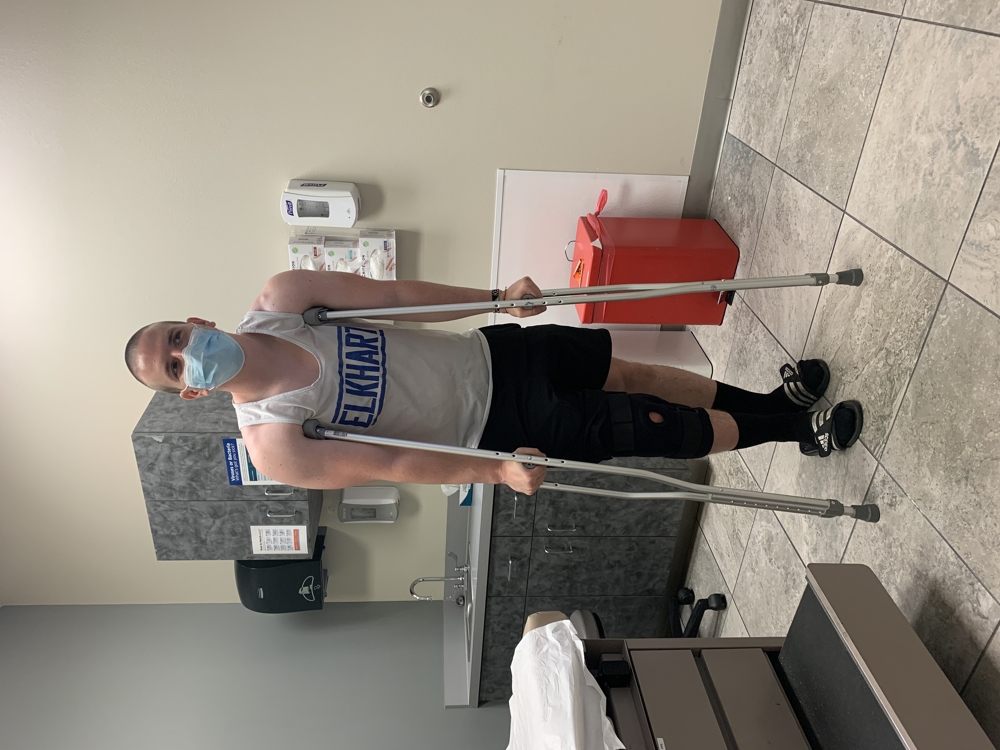

## The beginning

I’ve loved basketball since a young age.

After moving to the USA from Colombia, I realized sports besides soccer existed.

I gravitated towards basketball in particular because there was a hoop outside of our apartment.

I would spend hours outside playing knockout with neighborhood kids. My mom even bought me a glow-in-the-dark basketball so I could keep playing even as it got dark out.

  

In 5th grade, when you could join the elementary school basketball team, we also moved into a house.

First thing, my mom purchased a basketball hoop for our tiny driveway.

She even let me spray paint it, which I thought was awesome! 🎨

I would play 1-on-1 with my friend Dana endlessly.

I always had an unfair advantage because the driveway is so narrow, that the left side was my neighbor’s lawn.

He was left handed! 😂

  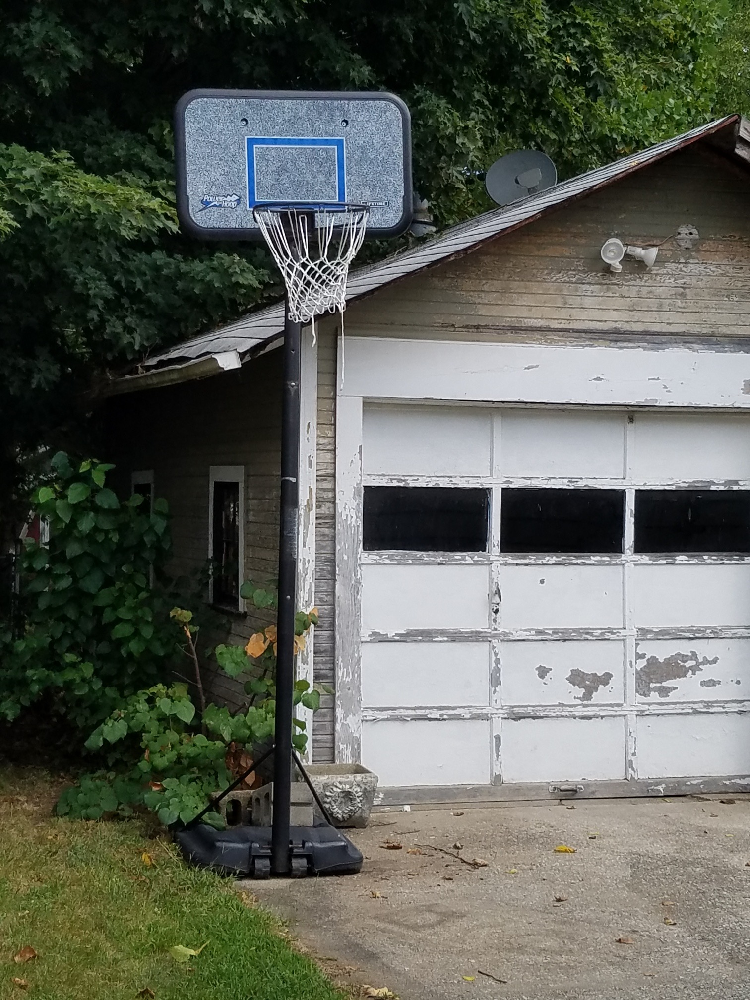

I was blessed to have a mother who let me play so much. I shattered all the windows in the garage with missed shots, and the basement window with a dunk-gone-wrong (I would lower the hoop to like 5 feet so I could dunk lol). She eventually replaced them all with plexiglass.

The hours practicing paid off.

I earned my stripes on the elementary school blacktop, where I was often the only white kid.

This earned me the nickname White Chocolate.

My first screen-name on AIM was ballerWC46516 (why my zip code? I have no idea).

## The middle

Then came 7th grade. With middle school came long hair and a seventh grade conference championship that I STILL reminisce about.

My friends give me shit because I’ve told the cinderella story so frequently. Gotta hold on to those golden years.

  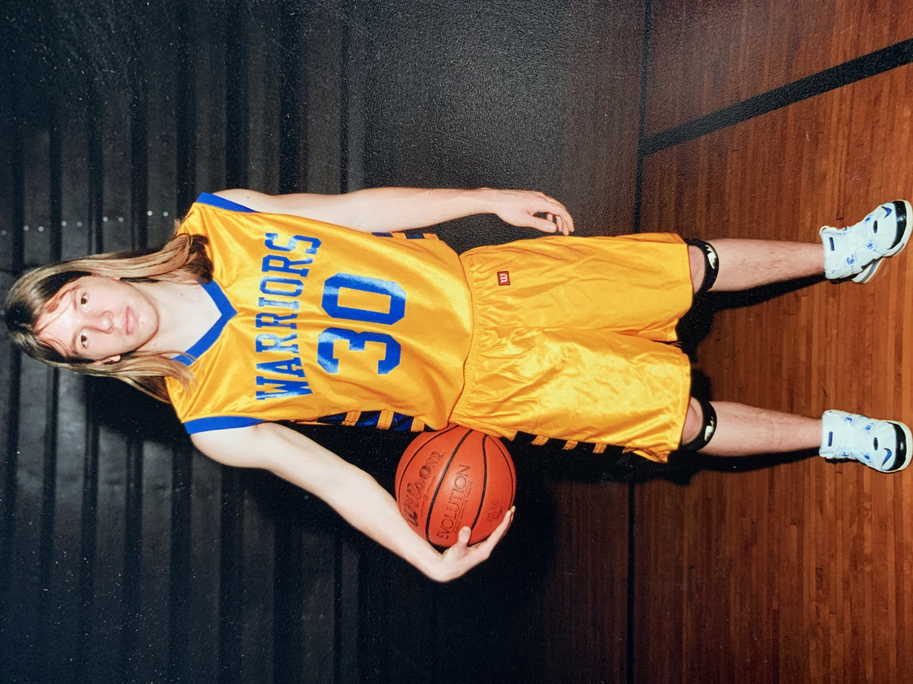

In the years that followed, I played travel ball and stuck with school ball through sophomore year of high school.

I quit the team junior year to pick up more hours at Subway.

The only sport I played junior and senior year was soccer ⚽️ — my original love.

  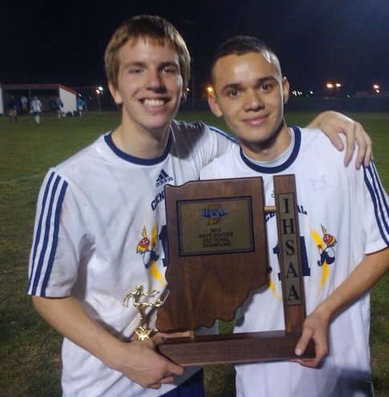

I never stopped hooping though. Far from it!

I spent my summers picking my friends up in my mom’s minivan, heading to the basketball court, and playing pickup games all day long.

Though I wasn't on any official teams, this was possibly the most fun I’ve ever had playing.

After high school I still wasn’t done.

At Purdue there were people willing to play pickup at all hours, intramurals, and other random tournaments.

I even got to play with my roommate, a player on the basketball team, at Mackey Arena. He might have beaten me, but I hit him with a DIRTY up-and-under. 😂

  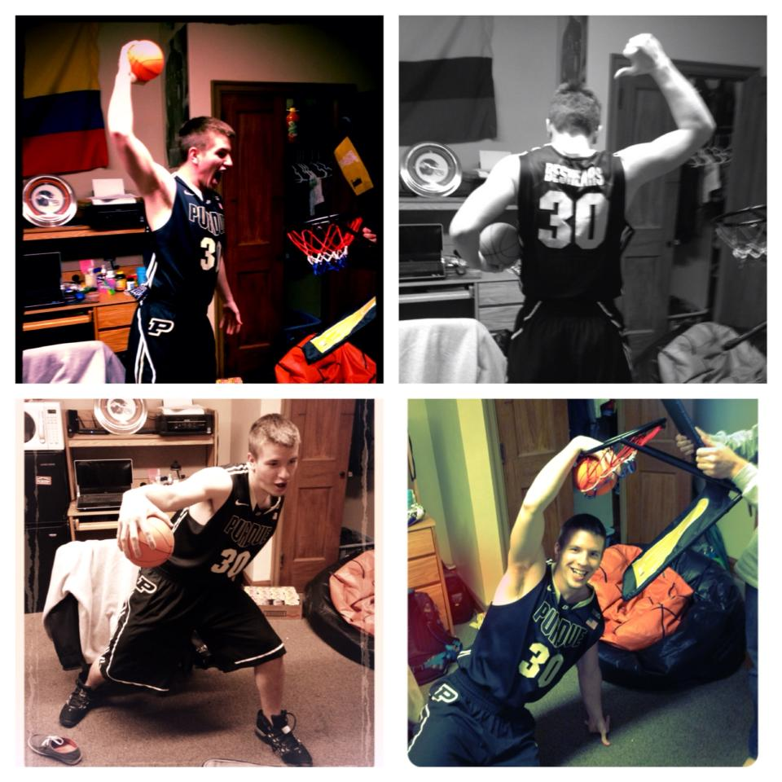

## The end

I balled a ton... until Intramural soccer got the best of me.

During the semi-final game I injured my knee (we won the championship though 😤).

  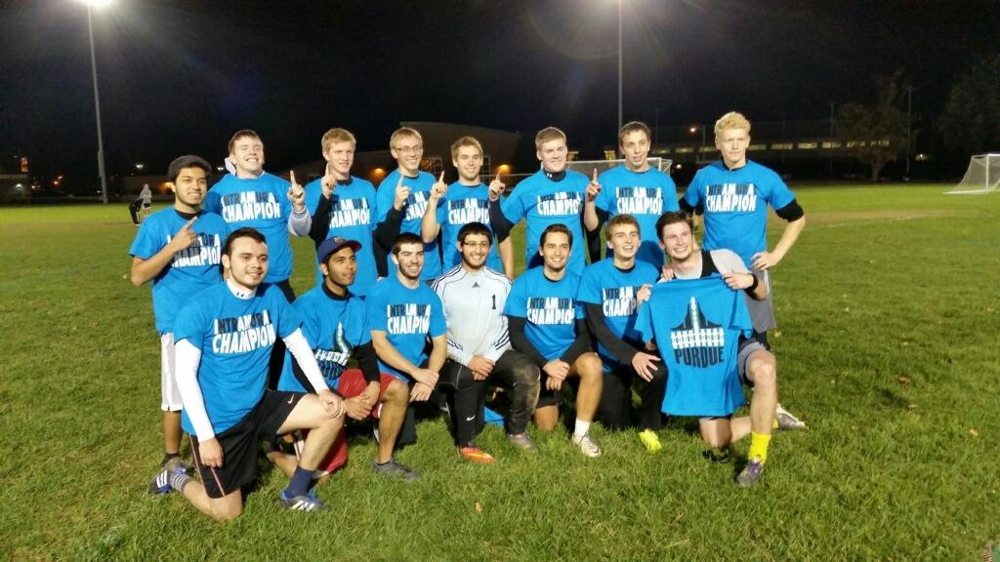

Being a broke college student, I just left it to heal alone.

I could get around alright, but I wasn't able to play sports competitively the rest of college.

In the 5 years since that injury, I can count on one hand the amount of times that I played any sort of basketball.

### A new beginning

I moved to Vegas a year ago.

My legs felt good. My apartment complex had an indoor court.

I decided it was time to get back out there. 😈

I tossed out my old shoes (Ironically that they were Derrick Rose shoes 😂), got some new ones, and started hitting the court.

You know how this ends.

  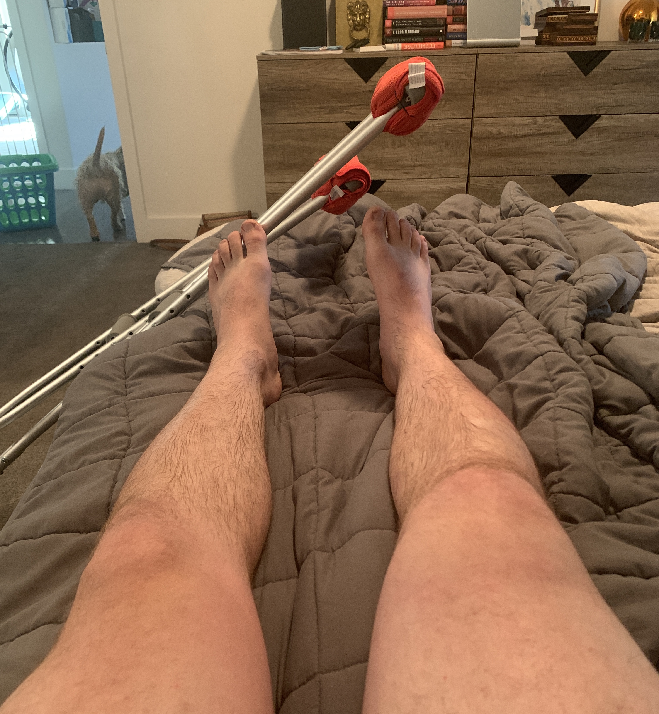

Two weeks ago I came down off of a rebound, felt my knee give way, and collapsed in pain.

Now, however, I have the means to get it properly taken care of.

I went to a specialist, got an MRI, and found out I have what he referred to as “One hell of an injury”.

I'm scheduled for knee surgery tomorrow, 9/1/20.

Most people would stay off the court for good.

They’d probably be smart to do so.

However....

In that month before the injury, I remembered my love for the game and got addicted again.

No way I'm quitting now.

I intend to be back out there, stronger and more injury-proof.

So how does this relate to my side-hustle?

Well, I no longer live in those apartments, so I don’t have easy access to a basketball court. Even when I did, it was hit or miss whether there would actually be people hooping or not.

Sure, I can (and will) buy a hoop to practice on, but it's not the same as running full-court.

I want to make sure I have ample opportunities to play once my knee heals in a year.

Unlike in high school where I had a group of 10 friends always ready to play, I need a new solution.

So, I started looking...

After a little research I stumbled across HoopMaps.

Turns out there’s already an app that does what I need! Hell the creators were even on shark tank a couple of years go!

  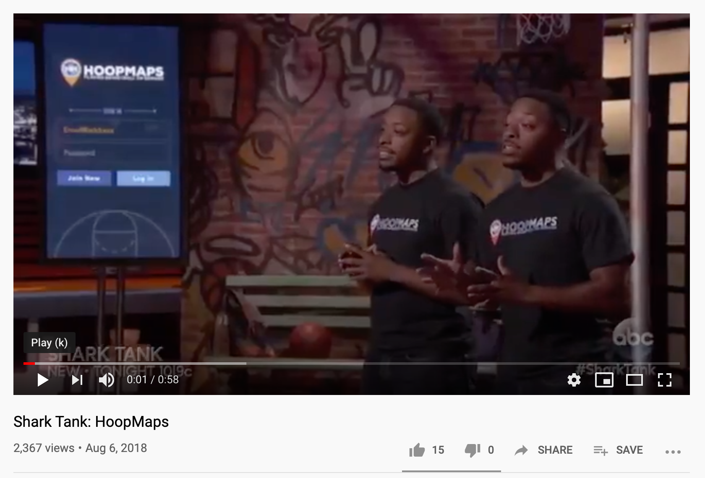

My favorite problems are solved ones!

The problem is, it does not work.

In order to use it at all, you need to create an account. I couldn’t get any of the account creation methods to work (if you can, let me know)!

This is too much friction for someone who just wants to see games going on around them.

  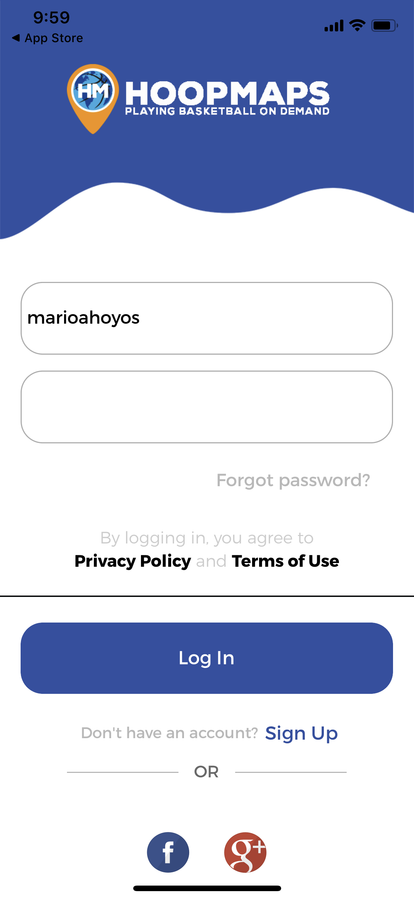

I looked at the reviews, and was both encouraged and disappointed.

Disappointed because others struggled to use the app. I was hoping I had a weird bug that could be easily fixed.

Encouraged because there’s people who want this, AND I know I can build it. 👷

  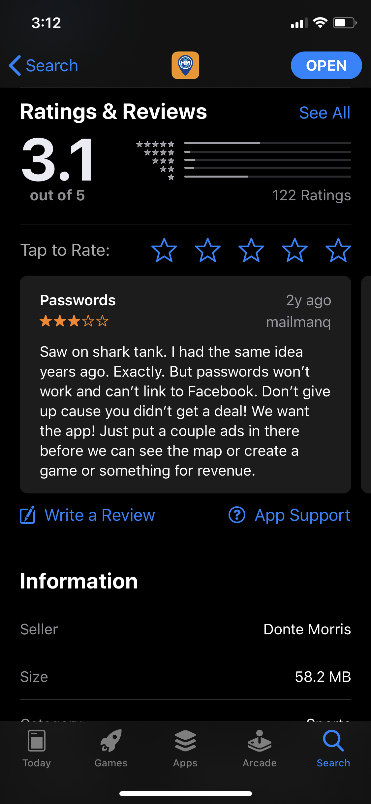

Soooo........

**I’m going to do it myself!**

The time I can’t spend playing ball I’m going to spend building https://hoopspots.com.

Claim your _Hooper-name_ before someone else steals it 🏀🔥

  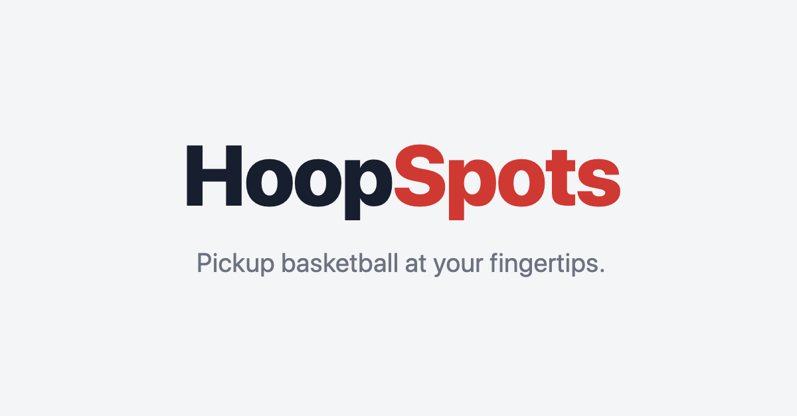

## Stay in touch

Go to [HoopSpots](https://hoopspots.com) and claim your Hooper-name and [follow me on twitter](https://twitter.com/marioahoyos) for more frequent updates!
